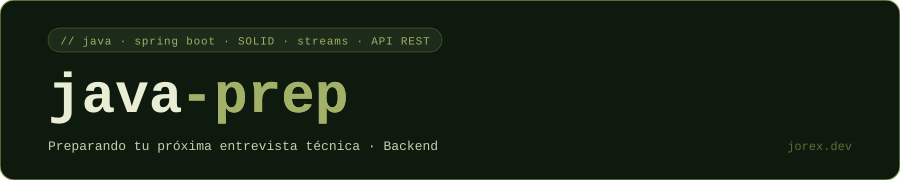

<div align="center">
  <a href="#"></a>
</div>

<br>

<div align="center">
  <a href="#"></a>
</div>

<div align="center">


</div>

<br>

```
src/
├── base/
│   ├── colecciones/       —  List, Set, Map, Queue, colecciones concurrentes
│   ├── concurrencia/      —  synchronized, volatile, locks, CompletableFuture, Virtual Threads
│   ├── genericos/         —  wildcards, bounded types, PECS
│   ├── streams/           —  operaciones + 30 ejercicios (fácil · medio · difícil)
│   ├── lambdas/
│   ├── excepciones/
│   └── opcional/
├── solid/                 —  los 5 principios con ejemplos de violación y corrección
├── patronesdiseno/        —  Singleton, Factory, Builder, Strategy, Observer, Adapter, Decorator
├── aop/                   —  @Before · @Around · @AfterReturning · @AfterThrowing
└── herramientas/          —  Maven · Gradle · Git · Docker
```

<br>

---

<br>

Cada tema tiene un archivo de intro con la teoría orientada a entrevistas — qué es, para qué sirve, cuándo usarlo y preguntas típicas — seguido de ejemplos de código en el mismo archivo o en una carpeta de ejemplos al lado.

Los ejercicios de Streams tienen los enunciados separados de las soluciones.

<br>

**pendiente** — Spring Boot · JPA/Hibernate · Spring Security · Testing · Microservicios · Observabilidad

<br>

---

<div align="center">
  <a href="https://jorex.dev">jorex.dev</a> &nbsp;·&nbsp; <a href="https://instagram.com/programando_con_jorge">@programando_con_jorge</a>
</div>
