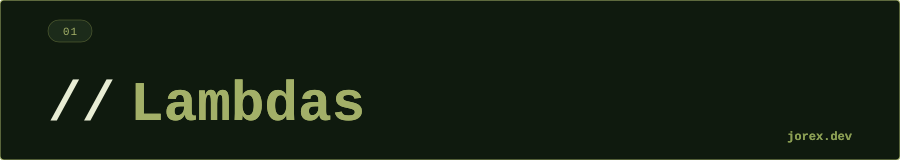

<div align="center">
  <a href="#"></a>
</div>

<div align="center"></div>

<div align="center">
  <a href="#"></a>
</div>

<div align="center"></div>

<div align="center">
  <a href="#"></a>
</div>

<div align="center"></div>

Una lambda es una **función anónima** que puede tratarse como un valor: asignarse a una variable, pasarse como argumento o devolverse desde un método. Introducidas en Java 8, su propósito principal es reemplazar las clases anónimas que implementaban interfaces funcionales, reduciendo el código repetitivo.

> Piensa en una lambda como una nota post-it con instrucciones. En vez de contratar a una persona (crear una clase entera) para que haga una tarea, escribes las instrucciones en el post-it y se lo das directamente a quien las necesite.

Una **interfaz funcional** es cualquier interfaz con un único método abstracto: `Runnable`, `Comparator<T>`, `Predicate<T>`, `Function<T,R>`, `Consumer<T>`...

**Sintaxis:**

```java
// Forma completa
(String s) -> { return s.length(); }

// Inferencia de tipos + expresión directa
s -> s.length()

// Sin parámetros
() -> System.out.println("Hola")

// Varios parámetros
(a, b) -> a + b
```

<div align="center"></div>

<div align="center">
  <a href="#"></a>
</div>

<div align="center"></div>

<div align="center">
  <a href="#"></a>
</div>

<div align="center"></div>

- Son funciones anónimas que se pueden pasar como parámetro.
- Se apoyan en interfaces funcionales (un solo método abstracto).
- Los tipos de parámetros se infieren automáticamente.
- Soportan expresiones simples o bloques con múltiples instrucciones.
- Pueden sustituirse por **referencias a métodos** (`::`) cuando el cuerpo es solo una llamada directa.

**Referencias a métodos (`::`):** atajo cuando la lambda no hace nada más que delegar en un método existente con la misma firma.

```java
// Lambda
Function<String, String> mayus = s -> s.toUpperCase();

// Equivalente con referencia a método
Function<String, String> mayus = String::toUpperCase;
```

El compilador acepta la sustitución porque `toUpperCase()` tiene exactamente la misma firma que `Function<String, String>` espera: recibe un `String` (la instancia) y devuelve un `String`.

| Interfaz | Firma | Descripción |
|---|---|---|
| `Runnable` | `() → void` | Ejecuta un bloque sin parámetros ni retorno |
| `Supplier<T>` | `() → T` | Produce un valor |
| `Consumer<T>` | `T → void` | Consume un valor sin devolver nada |
| `Function<T,R>` | `T → R` | Transforma un valor |
| `Predicate<T>` | `T → boolean` | Evalúa una condición |
| `BiFunction<T,U,R>` | `(T,U) → R` | Transforma dos valores |
| `UnaryOperator<T>` | `T → T` | Transforma un valor al mismo tipo |
| `Comparator<T>` | `(T,T) → int` | Compara dos valores |

<div align="center"></div>

<div align="center">
  <a href="#"></a>
</div>

<div align="center"></div>

<div align="center">
  <a href="#"></a>
</div>

<div align="center"></div>

- Eliminan el boilerplate de clases anónimas.
- Hacen el código más legible, especialmente en colecciones.
- Son la base de la API de Streams.
- Permiten programación declarativa/funcional dentro de Java.

Ver [ExpLambdas.java](ExpLambdas.java) para ejemplos ejecutables con `Runnable`, `Function`, `Consumer`, `Supplier`, `Predicate` y referencias a métodos.

<div align="center"></div>

<div align="center">
  <a href="#"></a>
</div>
