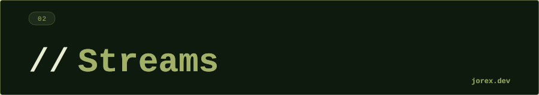

  

  

  

**¿Qué es un Stream y qué diferencia tiene con una colección?**
Una colección almacena datos; un Stream es un pipeline de procesamiento que no almacena nada. Un Stream solo puede consumirse una vez y sus operaciones son lazy: no se ejecutan hasta que se invoca una operación terminal.

---

**¿Qué diferencia hay entre operaciones intermedias y terminales?**
Las intermedias (filter, map, sorted...) devuelven un nuevo Stream y son lazy: se acumulan pero no se ejecutan. Las terminales (collect, forEach, count...) disparan la ejecución de toda la cadena y consumen el Stream.

---

**¿Qué es la evaluación perezosa (lazy evaluation) en Streams?**
Que las operaciones intermedias no se procesan elemento a elemento hasta que la operación terminal las necesita. Esto permite optimizaciones como cortocircuitos: `findFirst()` para en cuanto encuentra el primer elemento válido.

---

**¿Cuándo usarías `parallelStream()`?**
Cuando el dataset es grande, la operación es CPU-bound y no hay estado compartido entre elementos. En operaciones pequeñas o con I/O el overhead de división y reunión de hilos puede ser mayor que el beneficio.

---

**¿Qué diferencia hay entre `map()` y `flatMap()`?**
`map()` transforma cada elemento en otro elemento (1:1). `flatMap()` transforma cada elemento en un Stream de elementos y aplana todos los streams resultantes en uno (1:N). Se usa cuando el mapeo produce listas o streams anidados.

---

**¿Cuándo NO usarías Streams?**
Cuando necesitas modificar el estado externo (los Streams deben ser sin efectos secundarios), cuando el problema requiere acceso por índice, cuando la colección es muy pequeña (el overhead no merece), o cuando la lógica es más clara con un bucle tradicional.

---

**¿Cuándo evitarías `parallelStream()` aunque el dataset sea grande?**

Evítalo cuando: la fuente no es divisible eficientemente (ej. `LinkedList`), las operaciones tienen efectos secundarios o estado compartido, el trabajo por elemento es muy ligero (el overhead del `ForkJoinPool` supera el beneficio), o el orden importa y no puedes garantizar `forEachOrdered`. También hay que tener cuidado en entornos con pool de hilos contendido (ej. servidores de aplicaciones), ya que `parallelStream()` usa el `ForkJoinPool.commonPool()` compartido y puede causar inanición de otros hilos.

  

