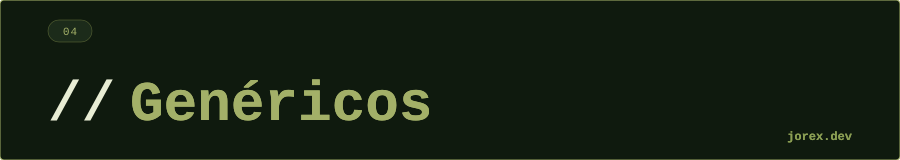

  

  

  

**¿Qué es el type erasure en Java?**
En compilación los tipos genéricos se borran y se reemplazan por `Object` (o el bound superior). Esto significa que en runtime `List<String>` y `List<Integer>` son indistinguibles. Permite compatibilidad con código pre-Java 5, pero impide crear arrays genéricos o hacer `instanceof List<String>`.

---

**¿Cuándo usarías `<? extends T>` vs `<? super T>`?**
`extends` (Producer) cuando lees elementos de la estructura — el tipo garantiza que lo que sale es al menos T. `super` (Consumer) cuando escribes elementos en la estructura — el tipo garantiza que puede recibir T. Regla mnemotécnica: **PECS** (Producer Extends, Consumer Super).

---

**¿Qué es PECS?**
Producer Extends, Consumer Super. Si un parámetro produce (devuelve) valores del tipo genérico, usa `extends`. Si los consume (los recibe/añade), usa `super`. Formulado por Joshua Bloch en Effective Java.

---

**¿Puedes crear arrays genéricos en Java?**
No directamente — `new T[10]` no compila. Se debe usar `(T[]) new Object[10]` con unchecked cast, o mejor, usar `List<T>`. La restricción existe por el type erasure: el array necesita el tipo real en runtime pero los genéricos lo borran.

---

**¿Qué diferencia hay entre `List<?>` y `List<Object>`?**
`List<Object>` acepta cualquier objeto pero no es compatible con `List<String>` (la herencia no se transfiere a genéricos). `List<?>` es un wildcard que representa "lista de algún tipo desconocido" — puedes leer de ella como Object pero no puedes añadir nada (excepto null).

  

