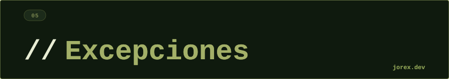

<div align="center">
  <a href="#"></a>
</div>

<div align="center"></div>

<div align="center">
  <a href="#"></a>
</div>

<div align="center"></div>

<div align="center">
  <a href="#"></a>
</div>

<div align="center"></div>

Las excepciones son el mecanismo de Java para manejar errores en tiempo de ejecución. La jerarquía parte de `Throwable`:

```
Throwable
├── Error          → Errores de la JVM (OutOfMemoryError, StackOverflowError) — no recuperables
└── Exception
    ├── RuntimeException  → Unchecked: NullPointerException, IllegalArgumentException...
    └── (otras)           → Checked: IOException, SQLException...
```

- **Checked**: el compilador obliga a capturarlas o declararlas con `throws`. Representan condiciones recuperables esperadas (archivo no encontrado, error de red...).
- **Unchecked** (RuntimeException): errores de programación, no se obliga a capturarlas.

<div align="center"></div>

<div align="center">
  <a href="#"></a>
</div>

<div align="center"></div>

<div align="center">
  <a href="#"></a>
</div>

<div align="center"></div>

**try-catch-finally:**
```java
try {
    // código que puede lanzar
} catch (IOException e) {
    // manejo específico
} catch (Exception e) {
    // manejo genérico (va al final)
} finally {
    // siempre se ejecuta (incluso con return)
}
```

**try-with-resources** (Java 7+): cierra automáticamente recursos que implementen `AutoCloseable`:
```java
try (InputStream is = new FileInputStream("file")) {
    // is se cierra automáticamente al salir
}
```

**Multi-catch:**
```java
catch (IOException | SQLException e) { ... }
```

**Excepción personalizada:**
```java
public class NegocioException extends RuntimeException {
    public NegocioException(String msg) { super(msg); }
}
```

<div align="center"></div>

<div align="center">
  <a href="#"></a>
</div>

<div align="center"></div>

<div align="center">
  <a href="#"></a>
</div>

<div align="center"></div>

-  Separa la lógica normal del manejo de errores.
- `try-with-resources` garantiza el cierre de recursos sin finally manual.
- Las excepciones personalizadas documentan los contratos del dominio.
- Las excepciones checked fuerzan el tratamiento explícito de condiciones esperadas.

Ver [ExceptionsHierarchy.java](ExceptionsHierarchy.java) y [CustomExceptions.java](CustomExceptions.java) para la jerarquía y ejemplos de excepciones custom.

<div align="center"></div>

<div align="center">
  <a href="#"></a>
</div>
