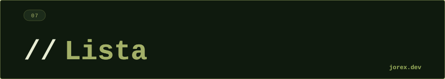

<div align="center">
  <a href="#"></a>
</div>

<div align="center"></div>

<div align="center">
  <a href="#"></a>
</div>

<div align="center"></div>

<div align="center">
  <a href="#"></a>
</div>

<div align="center"></div>

`List` es una colección **ordenada** (mantiene el orden de inserción) que **permite duplicados** y ofrece acceso por índice. Es la colección más usada en Java.

La elección de implementación importa: `ArrayList` y `LinkedList` tienen perfiles de rendimiento muy distintos según el tipo de operación.

<div align="center"></div>

<div align="center">
  <a href="#"></a>
</div>

<div align="center"></div>

<div align="center">
  <a href="#"></a>
</div>

<div align="center"></div>

| Implementación | Acceso por índice | Inserción/borrado extremos | Inserción/borrado medio | Notas |
|---|---|---|---|---|
| `ArrayList` | O(1) | O(n) amortizado | O(n) | Array dinámico. La opción por defecto. |
| `LinkedList` | O(n) | O(1) | O(n) con iterador | Lista doblemente enlazada. |
| `Vector` | O(1) | O(n) | O(n) | Legacy. Sincronizado. Evitar. |
| `Stack` | O(n) | O(1) | O(n) | Legacy. Usa `ArrayDeque` como stack. |

**ArrayList** es la opción por defecto para la mayoría de casos: acceso aleatorio rápido, iteración secuencial eficiente.

**LinkedList** solo es mejor que ArrayList cuando insertas/borras con frecuencia en los extremos **y** no necesitas acceso por índice. En la práctica, `ArrayDeque` suele ser mejor para ese caso.

```java
List<String> lista = new ArrayList<>();  // inmutable: List.of("a","b")
lista.add("Java");
lista.get(0);
lista.remove(0);
lista.sort(Comparator.naturalOrder());
```

<div align="center"></div>

<div align="center">
  <a href="#"></a>
</div>

<div align="center"></div>

<div align="center">
  <a href="#"></a>
</div>

<div align="center"></div>

-  Orden de inserción garantizado.
- Acceso por índice (`get(i)`) en O(1) con ArrayList.
- API rica: `sort`, `subList`, `listIterator`, `removeIf`, `replaceAll`.
- Interoperabilidad con Streams y lambdas.

Ver las implementaciones en [ExpArrayList.java](ExpArrayList.java), [ExpLinkedList.java](ExpLinkedList.java) y el resto de archivos para comparar comportamientos.

<div align="center"></div>

<div align="center">
  <a href="#"></a>
</div>
