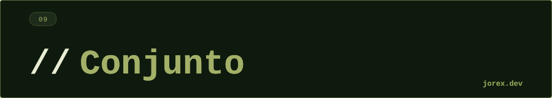

<div align="center">
  <a href="#"></a>
</div>

<div align="center"></div>

<div align="center">
  <a href="#"></a>
</div>

<div align="center"></div>

<div align="center">
  <a href="#"></a>
</div>

<div align="center"></div>

`Set` es una colección que **no permite duplicados**. Usa `equals()` y `hashCode()` para detectar si un elemento ya existe antes de insertarlo.

```java
Set<String> set = new HashSet<>();
set.add("Java");
set.add("Java");   // ignorado — duplicado
set.size();        // 1
```

Implementar correctamente `equals()` y `hashCode()` en tus clases es esencial para que los Sets funcionen correctamente.

<div align="center"></div>

<div align="center">
  <a href="#"></a>
</div>

<div align="center"></div>

<div align="center">
  <a href="#"></a>
</div>

<div align="center"></div>

| Implementación | Orden | Complejidad | Notas |
|---|---|---|---|
| `HashSet` | Ninguno | O(1) | Opción por defecto. Backed by HashMap. |
| `LinkedHashSet` | Inserción | O(1) | Orden predecible. |
| `TreeSet` | Natural/Comparator | O(log n) | Siempre ordenado. |
| `EnumSet` | Declaración enum | O(1) | Solo enums. Usa bits. Muy rápido. |
| `ConcurrentSkipListSet` | Natural | O(log n) | Thread-safe ordenado. |

**HashSet** es la opción por defecto para unicidad sin orden.

**TreeSet** implementa `NavigableSet`: además de `SortedSet`, permite operaciones como `floor()`, `ceiling()`, `headSet()`, `tailSet()` — útil para rangos.

**EnumSet** es la implementación más eficiente para conjuntos de valores de un enum (representación bit a bit).

<div align="center"></div>

<div align="center">
  <a href="#"></a>
</div>

<div align="center"></div>

<div align="center">
  <a href="#"></a>
</div>

<div align="center"></div>

-  Garantía de unicidad automática — sin lógica de deduplicación manual.
- HashSet: O(1) para contains, add, remove.
- TreeSet: iteración siempre ordenada + operaciones de rango.
- EnumSet: rendimiento excepcional para flags de enum.

Ver cada implementación en los archivos `Exp*.java` para comparar comportamientos.

<div align="center"></div>

<div align="center">
  <a href="#"></a>
</div>
