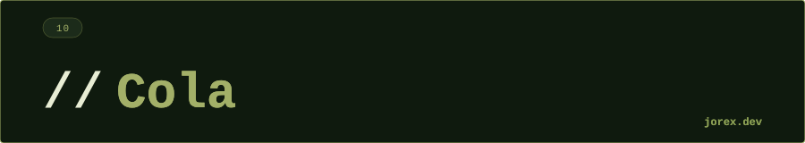

  

  

  

**¿Cuál es la diferencia entre `offer()` y `add()` en Queue?**
Ambos añaden al final, pero `add()` lanza `IllegalStateException` si la cola tiene capacidad limitada y está llena. `offer()` devuelve `false` en ese caso. Para colas sin límite (como LinkedList) son equivalentes, pero `offer()` es preferible por ser más seguro.

---

**¿Cuál es la diferencia entre `poll()` y `remove()`?**
Ambos extraen y eliminan el elemento del inicio. `remove()` lanza `NoSuchElementException` si la cola está vacía. `poll()` devuelve `null`. Patrón: usa `poll()` cuando la cola puede estar vacía; `remove()` cuando vacía es un error.

---

**¿Cuándo usarías PriorityQueue?**
Cuando necesitas procesar elementos por prioridad en lugar de por orden de llegada. Ejemplos: sistema de tickets de soporte por urgencia, algoritmo de Dijkstra, scheduler de tareas. El elemento con menor valor (según Comparable o Comparator) siempre es el primero en salir.

---

**¿Qué es BlockingQueue y en qué patrón se usa?**
Una Queue thread-safe que bloquea: `put()` espera si está llena, `take()` espera si está vacía. Implementa el patrón productor-consumidor sin semáforos ni `wait/notify` manuales. Las implementaciones más comunes son `ArrayBlockingQueue` (tamaño fijo) y `LinkedBlockingQueue` (tamaño opcional).

---

**¿Por qué ArrayDeque es preferible a LinkedList como Queue?**
ArrayDeque usa un array circular que evita la alocación de nodos en cada operación (LinkedList crea un nuevo objeto Node por cada elemento). Esto reduce la presión sobre el GC y mejora el rendimiento de caché de la CPU. Sin embargo, ArrayDeque no permite null.

  

