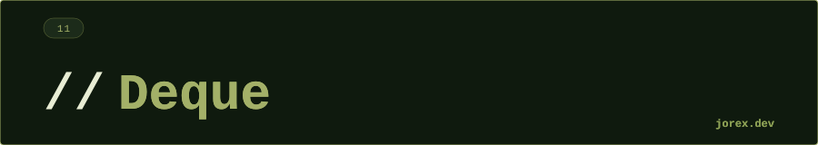

  

  

  

**¿Cuál es la diferencia entre Deque y Queue?**
Queue solo permite operaciones por un extremo: insertar al final, extraer del inicio (FIFO). Deque permite insertar y extraer por ambos extremos, lo que le da la flexibilidad de funcionar como cola (FIFO), pila (LIFO) o estructura de doble entrada.

---

**¿Por qué ArrayDeque es preferible a Stack?**
`Stack` extiende `Vector`, que está sincronizado (overhead innecesario en contexto single-thread) y tiene métodos heredados que no tienen sentido en una pila. `ArrayDeque` es más rápido, no está sincronizado innecesariamente y tiene una API más limpia con `push/pop/peek`.

---

**¿Puede ArrayDeque contener null?**
No — lanza `NullPointerException`. Esto es intencional: null se usa como valor centinela en los métodos como `peek()` (retorna null si está vacío), y permitir null como elemento crearía ambigüedad. `LinkedList` sí permite null si se necesita.

---

**¿Cuándo usarías Deque como stack vs como queue?**
Como stack cuando el orden de procesamiento es LIFO: historial de navegación, undo/redo, evaluación de expresiones, DFS (Depth-First Search). Como queue cuando el orden es FIFO: sistemas de mensajería, BFS (Breadth-First Search), procesamiento por orden de llegada.

---

**¿Qué diferencia hay entre `offerFirst()` y `push()`?**
`push(e)` es equivalente a `offerFirst(e)` — ambos insertan al frente. La diferencia semántica: `push` viene del vocabulario de stack (LIFO), `offerFirst` viene del vocabulario de deque (doble extremo). `push` lanza excepción si falla (capacidad); en ArrayDeque son equivalentes.

---

**¿Por qué ArrayDeque reemplaza a Stack en Java moderno?**
`Stack` extiende `Vector` (sincronizado), lo que introduce un overhead innecesario en contextos single-thread. Además hereda métodos de `Vector` como `get(int index)` que no tienen sentido semántico en una pila. `ArrayDeque` es la alternativa recomendada: más rápida, sin sincronización implícita y con API cohesionada. Solo si necesitas thread-safety usa `Deque` con un `LinkedBlockingDeque`.

---

**¿Cómo se implementa el patrón sliding window con un Deque?**
En problemas de ventana deslizante (ej. máximo/mínimo en ventana de tamaño k), el deque almacena índices del array manteniendo un orden útil. Al avanzar la ventana: se elimina del frente si el índice quedó fuera del rango, y se elimina del fondo mientras el elemento actual sea mayor/menor que el del fondo — garantizando O(n) total en vez de O(n*k). Ejemplo: `deque.offerLast(i)` para añadir, `deque.pollFirst()` para el máximo.

  

