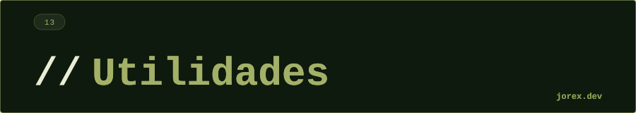

  

  

  

**¿Cuál es la diferencia entre Comparable y Comparator?**
`Comparable` define el orden natural de una clase — se implementa en la propia clase con `compareTo()`. `Comparator` define un orden alternativo o externo — es una función separada. Usa `Comparable` para el orden principal del dominio (ej. Persona por apellido); usa `Comparator` cuando necesitas múltiples órdenes o no puedes modificar la clase.

---

**¿Qué diferencia hay entre Iterator y ListIterator?**
`Iterator` solo avanza (`next`, `hasNext`, `remove`). `ListIterator` extiende Iterator y añade: `previous`, `hasPrevious`, `nextIndex`, `previousIndex`, `set` (reemplaza el elemento actual) y `add` (inserta en la posición actual). Solo disponible en listas.

---

**¿Para qué sirve `Collections.unmodifiableList()`?**
Crea una vista inmutable de la lista: cualquier intento de modificarla (add, remove, set) lanza `UnsupportedOperationException`. La lista subyacente sigue siendo mutable — es una vista, no una copia. Para una copia inmutable real, usa `List.copyOf()`.

---

**¿Qué diferencia hay entre Iterable e Iterator?**
`Iterable` es el contrato que implementan las colecciones: tienen un método `iterator()` que devuelve un `Iterator`. Es lo que hace que funcione el for-each. `Iterator` es el cursor que realiza la iteración: mantiene estado de posición y permite recorrer y eliminar elementos.

---

**¿Cuándo usarías un Comparator encadenado con `thenComparing()`?**
Para ordenación multicriteria: primero por un campo, en caso de empate por otro. Ejemplo: `Comparator.comparing(Empleado::getDepartamento).thenComparing(Empleado::getSalario, Comparator.reverseOrder())` — agrupa por departamento y dentro de cada grupo ordena por salario descendente.

---

**¿Cuál es la diferencia entre `Collections.unmodifiableList()` y `List.of()`?**
`Collections.unmodifiableList(lista)` crea una vista no modificable sobre la lista original: si la lista subyacente cambia, los cambios son visibles a través de la vista. `List.of(...)` crea una lista verdaderamente inmutable y autónoma: no permite null, no tiene lista subyacente mutable y cualquier intento de modificación lanza `UnsupportedOperationException`. Para defensiva real, usa `List.copyOf()` que hace una copia inmutable independiente.

---

**¿Cómo compones criterios de ordenación con `Comparator.comparing().thenComparing()`?**
`Comparator.comparing()` acepta un extractor de clave y aplica el orden natural o uno específico. `thenComparing()` añade criterios de desempate en cadena: `Comparator.comparing(Persona::getApellido).thenComparing(Persona::getNombre).thenComparingInt(Persona::getEdad)`. La cadena se evalúa de izquierda a derecha; solo se pasa al siguiente criterio si el anterior retorna cero. Los métodos `thenComparingInt/Long/Double` evitan el boxing de primitivos.

  

