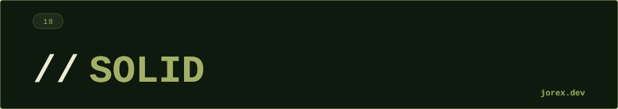

<div align="center">
  <a href="#"></a>
</div>

<div align="center"></div>

<div align="center">
  <a href="#"></a>
</div>

<div align="center"></div>

<div align="center">
  <a href="#"></a>
</div>

<div align="center"></div>

**¿Cómo detectas que una clase viola el SRP?**

*Corta:* si puedes describir la clase con "y también", tiene más de una responsabilidad.

*Si insisten:* "gestiona usuarios y también envía emails y también genera PDF" — cada "y también" es una responsabilidad extra. Señal más fiable que el tamaño: la clase cambia por razones distintas — la lógica de negocio cambia por un motivo, pero también cambia si cambias de proveedor de email.

---

**¿Qué relación tiene OCP con los patrones de diseño?**

*Corta:* OCP se implementa con polimorfismo — los patrones son las formas concretas de aplicarlo.

*Si insisten:* Strategy permite añadir comportamientos sin tocar el contexto. Template Method fija el esqueleto y deja los detalles a las subclases. Decorator añade responsabilidades sin modificar la clase original. Factory permite extender la creación de objetos sin tocar el código cliente.

---

**¿Puedes dar un ejemplo de violación de LSP?**

*Corta:* el clásico es `Cuadrado extends Rectángulo` — romper la invariante del padre en el hijo.

*Si insisten:* si `setAltura()` en `Cuadrado` también cambia el ancho para mantenerse cuadrado, cualquier código que opera sobre `Rectángulo` asumiendo alto y ancho independientes se rompe al recibir un `Cuadrado`.

---

**Trampa — ¿qué principio viola este código y por qué?**

```java
class NotificadorEmail {
    void enviar(String msg) { /* ... */ }
}
class NotificadorSMS extends NotificadorEmail {
    @Override
    void enviar(String msg) { throw new UnsupportedOperationException(); }
}
```

*Corta:* LSP — `NotificadorSMS` no puede sustituir a `NotificadorEmail` sin romper el contrato (lanza en vez de enviar).

*Si insisten:* la herencia aquí es forzada — "SMS es-un Email" no tiene sentido de dominio. La corrección es una interfaz `Notificador` común que ambos implementen, no heredar el uno del otro.

---

**¿Por qué es mejor tener muchas interfaces pequeñas que una grande?**

*Corta:* porque cada implementador solo implementa lo que realmente usa.

*Si insisten:* una interfaz "gorda" fuerza a implementar métodos irrelevantes (con `throws UnsupportedOperationException` o vacíos), lo que rompe el contrato y acaba violando también LSP.

---

**¿Cómo se relaciona DIP con la inyección de dependencias?**

*Corta:* DIP es el principio — depender de abstracciones, no de implementaciones. DI es el mecanismo que lo hace posible en runtime.

*Si insisten:* el módulo de alto nivel no debe depender de módulos de bajo nivel; ambos dependen de interfaces. Spring construye el grafo de dependencias inyectando implementaciones concretas donde se declaran interfaces — eso es DI aplicando DIP.

---

**¿Cuándo es aceptable violar conscientemente un principio SOLID?**

*Corta:* cuando el coste de aplicarlo supera el beneficio en ese contexto concreto.

*Si insisten:* SRP puede relajarse en entidades pequeñas donde dividir añade complejidad sin ganancia real. OCP no aplica bien a código que cambia de forma coordinada. ISP en servicios internos puede ser sobreingeniería. La clave: reconocer la violación y documentarla — no hacerlo por desconocimiento o prisa.

---

**¿Qué problemas concretos resuelve LSP?**

*Corta:* que el código que usa una abstracción no tenga que preocuparse por el tipo concreto que recibe.

*Si insisten:* violarlo lleva a `instanceof` checks y contratos rotos. Ejemplo real: un `ReadOnlyList` que extiende `List` pero lanza excepción en `add()` — cualquier código que llama `add()` sobre una `List` se rompe en runtime con ese subtipo. Regla práctica: los tests del subtipo deben pasar también con los casos del supertipo (principio de sustitución de Hoare).

<div align="center"></div>

<div align="center">
  <a href="#"></a>
</div>
