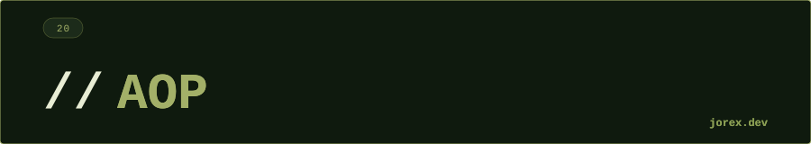

<div align="center">
  <a href="#"></a>
</div>

<div align="center"></div>

<div align="center">
  <a href="#"></a>
</div>

<div align="center"></div>

<div align="center">
  <a href="#"></a>
</div>

<div align="center"></div>

**Aspect-Oriented Programming (AOP)** es un paradigma que permite separar los **cross-cutting concerns** (preocupaciones transversales) del código de negocio. Un cross-cutting concern es lógica que se repite en múltiples puntos del sistema: logging, seguridad, transacciones, auditoría, métricas.

Sin AOP:
```java
public void crearPedido(Pedido p) {
    log.info("Inicio crearPedido"); // logging mezclado con negocio
    checkSeguridad();               // seguridad mezclada
    // lógica de negocio real
    log.info("Fin crearPedido");
}
```

Con AOP, la lógica de negocio queda limpia y los concerns transversales se definen en **Aspectos** separados.

<div align="center"></div>

<div align="center">
  <a href="#"></a>
</div>

<div align="center"></div>

<div align="center">
  <a href="#"></a>
</div>

<div align="center"></div>

**Conceptos clave:**

| Concepto | Descripción |
|---|---|
| **Aspect** | Clase que encapsula el cross-cutting concern |
| **JoinPoint** | Punto de ejecución donde se puede aplicar un aspecto (método, constructor...) |
| **Pointcut** | Expresión que selecciona qué JoinPoints aplicar |
| **Advice** | El código que se ejecuta en el JoinPoint |
| **Weaving** | Proceso de insertar los aspectos en el código |

**Tipos de Advice:**

| Advice | Cuándo se ejecuta |
|---|---|
| `@Before` | Antes del método |
| `@After` | Después del método (siempre) |
| `@AfterReturning` | Solo si el método retorna normalmente |
| `@AfterThrowing` | Solo si el método lanza excepción |
| `@Around` | Rodea el método — control total |

**Spring AOP usa proxies:** en lugar de modificar el bytecode, Spring envuelve el bean en un proxy (JDK dynamic proxy para interfaces, CGLIB para clases). Por eso AOP no intercepta llamadas internas (this.metodo()).

<div align="center"></div>

<div align="center">
  <a href="#"></a>
</div>

<div align="center"></div>

<div align="center">
  <a href="#"></a>
</div>

<div align="center"></div>

-  Código de negocio limpio: sin logging, seguridad ni transacciones mezcladas.
- Reutilización: un aspecto aplica a cualquier método que coincida con el pointcut.
- Spring Boot usa AOP internamente para `@Transactional`, `@Cacheable`, `@Secured`.
- Cambios en concerns transversales no requieren modificar la lógica de negocio.

Ver [Examples.java](Examples.java) para ejemplos de aspectos con `@Before`, `@Around` y `@AfterThrowing`.

<div align="center"></div>

<div align="center">
  <a href="#"></a>
</div>
