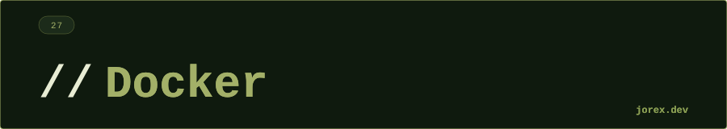

<div align="center">
  <a href="#"></a>
</div>

<div align="center"></div>

<div align="center">
  <a href="#"></a>
</div>

<div align="center"></div>

<div align="center">
  <a href="#"></a>
</div>

<div align="center"></div>

**Docker** empaqueta aplicaciones con todas sus dependencias en **contenedores** portables e inmutables. El mismo contenedor funciona igual en cualquier entorno: desarrollo, testing y producción.

```
Sin Docker: "funciona en mi máquina"
Con Docker:  la misma imagen corre en cualquier máquina con Docker
```

**Conceptos clave:**
- **Image**: plantilla inmutable de solo lectura. Define qué hay en el contenedor.
- **Container**: instancia ejecutable de una imagen. Tiene estado en runtime.
- **Volume**: almacenamiento persistente fuera del contenedor (los datos en el contenedor se pierden al eliminarlo).
- **Network**: red virtual para comunicación entre contenedores.

<div align="center"></div>

<div align="center">
  <a href="#"></a>
</div>

<div align="center"></div>

<div align="center">
  <a href="#"></a>
</div>

<div align="center"></div>

**Dockerfile — instrucciones básicas:**

```dockerfile
FROM eclipse-temurin:21-jre-alpine     # imagen base
WORKDIR /app                            # directorio de trabajo
COPY target/app.jar app.jar             # copia el JAR
EXPOSE 8080                             # documenta el puerto
CMD ["java", "-jar", "app.jar"]         # comando de arranque
```

**Comandos esenciales:**

```bash
docker build -t miapp:1.0 .       # construye imagen desde Dockerfile
docker run -p 8080:8080 miapp:1.0 # ejecuta contenedor
docker ps                          # contenedores en ejecución
docker stop <id>                   # para el contenedor
docker rm <id>                     # elimina el contenedor
docker images                      # lista imágenes locales
docker pull postgres:16            # descarga imagen de Docker Hub
docker push miusuario/miapp:1.0    # sube imagen a Docker Hub
```

**docker-compose** para múltiples contenedores:
```yaml
services:
  app:
    build: .
    ports: ["8080:8080"]
    depends_on: [db]
  db:
    image: postgres:16
    environment:
      POSTGRES_PASSWORD: secret
```

<div align="center"></div>

<div align="center">
  <a href="#"></a>
</div>

<div align="center"></div>

<div align="center">
  <a href="#"></a>
</div>

<div align="center"></div>

-  "Build once, run anywhere": reproducibilidad total entre entornos.
- Aislamiento: cada aplicación tiene sus propias dependencias sin conflictos.
- docker-compose para levantar entornos completos (app + DB + Redis) con un comando.
- Base de cualquier pipeline CI/CD moderno y despliegue en Kubernetes.

Ver [ExpImageLayers.java](ExpImageLayers.java), [ExpMultistageBuilder.java](ExpMultistageBuilder.java), [ExpDockerCompose.java](ExpDockerCompose.java) y [ExpContainerLifecycle.java](ExpContainerLifecycle.java) para ejemplos ejecutables con capas de imagen, builds multistage, Docker Compose y ciclo de vida de contenedores.

<div align="center"></div>

<div align="center">
  <a href="#"></a>
</div>
