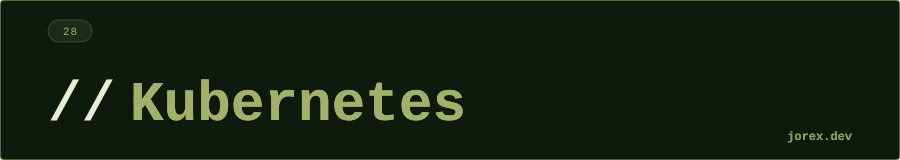

  

  

  

**¿Qué diferencia hay entre un Pod y un Deployment?**
Un Pod es la unidad mínima de despliegue — agrupa contenedores pero no se autorregenera si falla. Un Deployment es un objeto de nivel superior que gestiona un conjunto de réplicas de Pods: asegura que siempre haya N pods en ejecución, gestiona rolling updates y permite rollback.

---

**¿Qué tipos de Service existen en Kubernetes?**
ClusterIP (default): solo accesible dentro del cluster — para comunicación interna entre servicios. NodePort: expone el servicio en un puerto de cada nodo del cluster — para acceso externo básico. LoadBalancer: crea un load balancer externo en la nube (AWS ELB, GCP LB) — para acceso externo en producción. ExternalName: mapea a un DNS externo.

---

**¿Qué es un HPA (Horizontal Pod Autoscaler)?**
Un controlador que escala automáticamente el número de réplicas de un Deployment basándose en métricas (CPU, memoria, métricas personalizadas). Define un rango `minReplicas`/`maxReplicas` y un umbral (ej. 70% CPU). Cuando la carga sube, añade pods; cuando baja, los reduce.

---

**¿Cómo almacenas configuración sensible en Kubernetes?**
Con Secrets — codificados en base64 (no cifrados por defecto). Se inyectan como variables de entorno o como archivos montados en el pod. Para producción real, se complementa con herramientas como HashiCorp Vault, AWS Secrets Manager o cifrado en reposo de etcd.

---

**¿Qué diferencia hay entre ConfigMap y Secret?**
ConfigMap para configuración no sensible (URLs, feature flags, configuración de la app). Secret para datos sensibles (passwords, tokens, certificados) — almacenados codificados en base64 y con acceso más restringido. Ambos se inyectan en pods como env vars o archivos montados.

---

**¿Cuál es la diferencia entre liveness probe y readiness probe?**
La liveness probe comprueba si el proceso está vivo: si falla, Kubernetes reinicia el contenedor. La readiness probe comprueba si el contenedor está listo para recibir tráfico: si falla, Kubernetes lo elimina del endpoint del Service pero no lo reinicia. Un pod puede estar vivo (liveness OK) pero no listo (readiness KO) durante el calentamiento de la JVM o mientras carga datos. Confundirlas puede provocar reinicios en bucle o tráfico enviado a pods no preparados.

---

**¿Qué son los resource requests y limits y por qué son importantes?**
Los `requests` son los recursos que el scheduler garantiza al pod (se usan para decidir en qué nodo colocarlo). Los `limits` son el máximo que puede consumir; si los supera (memoria), el proceso es terminado por OOMKiller; si supera CPU, se throttlea. Sin limits, un pod puede consumir todos los recursos del nodo y afectar a otros pods. La recomendación es igualar requests y limits en producción (Guaranteed QoS) para comportamiento predecible.

  

