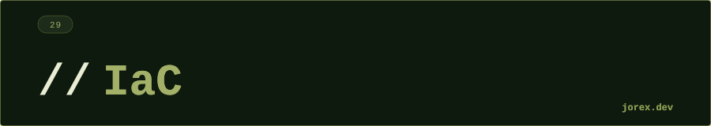

<div align="center">
  <a href="#"></a>
</div>

<div align="center"></div>

<div align="center">
  <a href="#"></a>
</div>

<div align="center"></div>

<div align="center">
  <a href="#"></a>
</div>

<div align="center"></div>

**Infrastructure as Code (IaC)** es la práctica de gestionar y aprovisionar infraestructura mediante código versionable en lugar de procesos manuales. Las dos herramientas más usadas son Terraform y Ansible — con roles complementarios.

| | Terraform | Ansible |
|---|---|---|
| **Propósito** | Provisionar infraestructura | Configurar/gestionar sistemas |
| **Lenguaje** | HCL (declarativo) | YAML Playbooks (imperativo/declarativo) |
| **Agente** | No | No (SSH) |
| **Estado** | State file | Idempotente |
| **Mejor para** | Cloud infrastructure | Configuración de servidores |

<div align="center"></div>

<div align="center">
  <a href="#"></a>
</div>

<div align="center"></div>

<div align="center">
  <a href="#"></a>
</div>

<div align="center"></div>

**Terraform:**
```hcl
# main.tf
provider "aws" { region = "eu-west-1" }

resource "aws_instance" "app" {
  ami           = "ami-0c55b159cbfafe1f0"
  instance_type = "t3.medium"
  tags = { Name = "mi-app" }
}
```

```bash
terraform init     # inicializa providers
terraform plan     # muestra cambios sin aplicar
terraform apply    # aplica los cambios
terraform destroy  # elimina la infraestructura
```

El **state file** (`terraform.tfstate`) registra el estado real de la infraestructura. En equipo, se almacena en un backend remoto (S3 + DynamoDB para locking).

**Ansible:**
```yaml
# playbook.yml
- hosts: servidores_web
  tasks:
    - name: Instalar Nginx
      apt: name=nginx state=present
    - name: Copiar configuración
      template: src=nginx.conf.j2 dest=/etc/nginx/nginx.conf
```

- **Agentless**: se conecta vía SSH, sin instalar nada en los servidores.
- **Idempotente**: ejecutar el playbook múltiples veces produce el mismo resultado.

<div align="center"></div>

<div align="center">
  <a href="#"></a>
</div>

<div align="center"></div>

<div align="center">
  <a href="#"></a>
</div>

<div align="center"></div>

-  Infraestructura versionable en git: historial, revisiones, rollback.
- Reproducibilidad: el mismo código genera la misma infraestructura siempre.
- Colaboración: pull requests para cambios de infraestructura.
- Terraform para cloud (AWS/GCP/Azure); Ansible para configuración y despliegue.

Ver [ExpIdempotency.java](ExpIdempotency.java), [ExpTerraformState.java](ExpTerraformState.java), [ExpModuleComposition.java](ExpModuleComposition.java) y [ExpDriftDetection.java](ExpDriftDetection.java) para ejemplos ejecutables con idempotencia, gestión de estado, composición de módulos Terraform y detección de drift.

<div align="center"></div>

<div align="center">
  <a href="#"></a>
</div>
