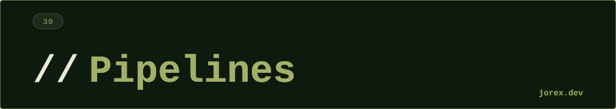

<div align="center">
  <a href="#"></a>
</div>

<div align="center"></div>

<div align="center">
  <a href="#"></a>
</div>

<div align="center"></div>

<div align="center">
  <a href="#"></a>
</div>

<div align="center"></div>

**CI/CD** (Continuous Integration / Continuous Delivery) es la práctica de automatizar la integración, testing y despliegue del código. Cada cambio en el repositorio desencadena un pipeline que verifica y despliega la aplicación.

- **CI**: integración continua — compilar, testear, analizar el código automáticamente en cada push.
- **CD**: entrega/despliegue continuo — desplegar automáticamente a staging o producción tras CI exitosa.

<div align="center"></div>

<div align="center">
  <a href="#"></a>
</div>

<div align="center"></div>

<div align="center">
  <a href="#"></a>
</div>

<div align="center"></div>

**GitHub Actions:**
```yaml
# .github/workflows/ci.yml
name: CI
on: [push, pull_request]
jobs:
  build:
    runs-on: ubuntu-latest
    steps:
      - uses: actions/checkout@v4
      - uses: actions/setup-java@v4
        with: { java-version: '21' }
      - run: mvn clean verify
      - run: docker build -t miapp:${{ github.sha }} .
```

**Jenkins (Declarative Pipeline):**
```groovy
// Jenkinsfile
pipeline {
    agent any
    stages {
        stage('Build') { steps { sh 'mvn clean package' } }
        stage('Test')  { steps { sh 'mvn test' } }
        stage('Deploy') { steps { sh 'kubectl apply -f k8s/' } }
    }
}
```

**GitLab CI:**
```yaml
# .gitlab-ci.yml
stages: [build, test, deploy]
build-job:
  stage: build
  script: mvn clean package
  artifacts:
    paths: [target/*.jar]
test-job:
  stage: test
  script: mvn test
```

<div align="center"></div>

<div align="center">
  <a href="#"></a>
</div>

<div align="center"></div>

<div align="center">
  <a href="#"></a>
</div>

<div align="center"></div>

-  Detección temprana de errores: cada commit se verifica automáticamente.
- Despliegues frecuentes y seguros: proceso automatizado y reproducible.
- Trazabilidad: cada despliegue está vinculado a un commit específico.
- Rollback rápido: pipelines con aprobación manual y rollback automatizado.

Este módulo es solo teoría — los pipelines se configuran en el repositorio del proyecto.

<div align="center"></div>

<div align="center">
  <a href="#"></a>
</div>
