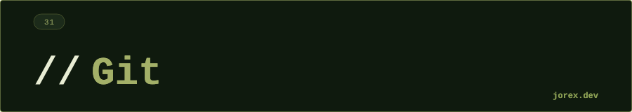

<div align="center">
  <a href="#"></a>
</div>

<div align="center"></div>

<div align="center">
  <a href="#"></a>
</div>

<div align="center"></div>

<div align="center">
  <a href="#"></a>
</div>

<div align="center"></div>

**Git** es un sistema de control de versiones **distribuido**: cada clon es un repositorio completo con todo el historial. No depende de un servidor central para trabajar — el servidor remoto (GitHub, GitLab) es simplemente otro repositorio con el que se sincroniza.

```
Working Directory  →  Staging Area  →  Local Repository  →  Remote
(git add)              (git commit)         (git push)
```

Las **tres zonas** de Git: el directorio de trabajo (archivos editados), el staging area (cambios preparados para commit) y el repositorio local (historial de commits).

<div align="center"></div>

<div align="center">
  <a href="#"></a>
</div>

<div align="center"></div>

<div align="center">
  <a href="#"></a>
</div>

<div align="center"></div>

**Operaciones de historial:**

```bash
git log --oneline --graph    # historial visual
git diff HEAD~1              # cambios del último commit
git blame archivo.java       # quién cambió cada línea
git stash                    # guarda cambios sin commitear
git stash pop                # recupera el stash
```

**Branching y merging:**
```bash
git checkout -b feature/nueva  # crea y cambia a nueva rama
git merge feature/nueva        # merge (fast-forward o merge commit)
git rebase main                # reescribe historial sobre main (lineal)
git cherry-pick <sha>          # aplica un commit específico
```

**Diferencia clave merge vs rebase:**
- `merge`: preserva el historial real (merge commit), no reescribe.
- `rebase`: historial lineal y limpio, pero reescribe los commits — nunca en ramas compartidas.

**Trabajo con remoto:**
```bash
git fetch origin    # descarga cambios sin integrar
git pull            # fetch + merge
git push origin main
git remote -v       # lista remotos
```

<div align="center"></div>

<div align="center">
  <a href="#"></a>
</div>

<div align="center"></div>

<div align="center">
  <a href="#"></a>
</div>

<div align="center"></div>

-  Historial completo local: puedes trabajar offline.
- Branches baratas: crear y fusionar ramas es instantáneo.
- Colaboración: pull requests, code review, CI integrada.
- `git stash` para cambiar de contexto sin perder trabajo en progreso.

Ver [ExpComandos.java](ExpComandos.java), [ExpMergeVsRebase.java](ExpMergeVsRebase.java), [ExpInteractiveRebase.java](ExpInteractiveRebase.java), [ExpCommitGraph.java](ExpCommitGraph.java) y [ExpGitInternals.java](ExpGitInternals.java) para ejemplos ejecutables con comandos Git, merge vs rebase, rebase interactivo e internos del objeto store.

<div align="center"></div>

<div align="center">
  <a href="#"></a>
</div>
