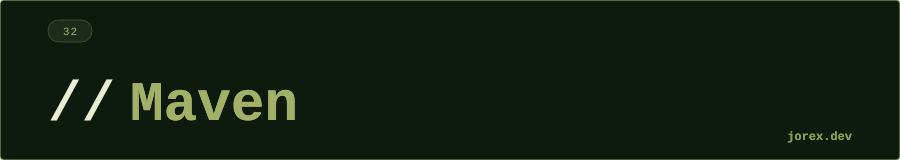

<div align="center">
  <a href="#"></a>
</div>

<div align="center"></div>

<div align="center">
  <a href="#"></a>
</div>

<div align="center"></div>

<div align="center">
  <a href="#"></a>
</div>

<div align="center"></div>

**Maven** es la herramienta de build automation más extendida en proyectos Java empresariales. Se basa en **convención sobre configuración**: una estructura estándar de proyecto que todas las herramientas entienden.

```
pom.xml                    ← descriptor del proyecto
src/
├── main/
│   ├── java/              ← código fuente
│   └── resources/         ← configuración, properties
└── test/
    ├── java/              ← tests
    └── resources/         ← configuración de tests
target/                    ← output de build (generado)
```

Cada artefacto Maven se identifica por sus **coordenadas**: `groupId:artifactId:version` (GAV).

<div align="center"></div>

<div align="center">
  <a href="#"></a>
</div>

<div align="center"></div>

<div align="center">
  <a href="#"></a>
</div>

<div align="center"></div>

**Ciclo de vida de build** (fases en orden):

```
validate → compile → test → package → verify → install → deploy
```

Al ejecutar una fase, Maven ejecuta todas las anteriores automáticamente:
```bash
mvn package        # validate + compile + test + package
mvn clean install  # limpia target, luego todo hasta install
mvn deploy         # todo el ciclo + publica en repositorio remoto
```

**pom.xml básico:**
```xml
<project>
  <groupId>com.ejemplo</groupId>
  <artifactId>mi-app</artifactId>
  <version>1.0.0-SNAPSHOT</version>

  <dependencies>
    <dependency>
      <groupId>org.springframework.boot</groupId>
      <artifactId>spring-boot-starter-web</artifactId>
      <version>3.3.4</version>
    </dependency>
  </dependencies>
</project>
```

**Repositorios:** Local (`~/.m2/repository`) → Central (Maven Central) → Privado (Nexus/Artifactory). Maven busca en ese orden.

**Perfiles** para configuraciones por entorno:
```xml
<profiles>
  <profile>
    <id>prod</id>
    <properties><db.url>jdbc:postgresql://prod...</db.url></properties>
  </profile>
</profiles>
```

<div align="center"></div>

<div align="center">
  <a href="#"></a>
</div>

<div align="center"></div>

<div align="center">
  <a href="#"></a>
</div>

<div align="center"></div>

-  Gestión automática de **dependencias transitivas**: no necesitas añadir manualmente las deps de tus deps.
- Estructura estándar reconocida por todos los IDEs y herramientas CI.
- `mvn clean install` reproducible: el mismo pom.xml genera siempre el mismo JAR.
- Integración directa con Spring Initializr, Jenkins, GitHub Actions.

Ver [ExpComandos.java](ExpComandos.java) y [ExpProfilesYPlugins.java](ExpProfilesYPlugins.java) para ejemplos ejecutables con el ciclo de vida Maven, comandos esenciales, perfiles y configuración de plugins.

<div align="center"></div>

<div align="center">
  <a href="#"></a>
</div>
