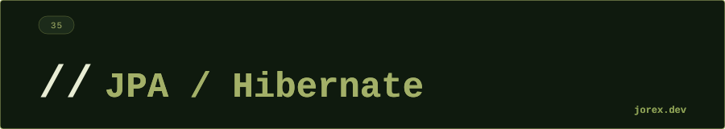

  

  

  

**¿Qué diferencia hay entre JPA y Hibernate?**
JPA es una especificación (un conjunto de interfaces y anotaciones del estándar Jakarta EE) que define cómo hacer ORM en Java. Hibernate es la implementación más popular de esa especificación — proporciona el código real que ejecuta las queries, gestiona el caché y genera el SQL. Usar JPA directamente en el código garantiza portabilidad: podrías cambiar Hibernate por EclipseLink sin tocar el código de negocio. En la práctica, casi todos los proyectos Spring Boot usan Hibernate como provider subyacente.

---

**Explica el ciclo de vida de una entidad JPA (estados)**
Una entidad pasa por cuatro estados: **Transient** — objeto creado con `new`, JPA no lo conoce y no está en BD. **Managed** — vinculado al `PersistenceContext` tras `persist()` o `find()`; cualquier cambio se detecta automáticamente (dirty checking) y se sincroniza con BD al hacer `flush()` o `commit()`. **Detached** — desconectado del contexto (tras `detach()`, `close()` o fin de transacción); los cambios no se propagan hasta hacer `merge()` para reincorporarlo. **Removed** — marcado para eliminar tras `remove()`; se borra en BD en el siguiente flush.

---

**¿Qué es el problema N+1 y cómo lo solucionas?**
Ocurre cuando cargas N entidades y luego accedes a una relación lazy de cada una: Hibernate ejecuta 1 query inicial + N queries adicionales (una por entidad padre). Ejemplo: 100 departamentos → 101 queries en total. Soluciones: (1) **FETCH JOIN** en JPQL: `SELECT DISTINCT d FROM Departamento d JOIN FETCH d.empleados` — una sola query con JOIN. (2) **`@BatchSize(size=25)`** en la colección: Hibernate agrupa los lazy loads en batches de 25 → 5 queries en lugar de 100. (3) **`@EntityGraph`** en Spring Data para especificar qué relaciones cargar en una query concreta. La causa raíz suele ser `FetchType.LAZY` sin join explícito — detectarlo con un log de queries SQL habilitado.

---

**FetchType.LAZY vs EAGER: ¿cuándo usar cada uno?**
`LAZY` carga la relación solo cuando se accede al campo — es el comportamiento por defecto en `@OneToMany` y `@ManyToMany` y el recomendado en general. Evita traer datos innecesarios de BD. Riesgo: `LazyInitializationException` si se accede fuera de la transacción. `EAGER` carga la relación junto con la entidad padre siempre, en cada `find()` o query. Solo tiene sentido si la relación es pequeña y siempre se necesita (ej. `@ManyToOne` de un usuario a su rol). Nunca uses `EAGER` en colecciones grandes — puede traer miles de registros con cada carga.

---

**¿Qué hace @Transactional y qué niveles de propagación existen?**
`@Transactional` es un aspecto que Spring AOP aplica al método: abre una transacción antes de ejecutarlo y hace commit al terminar (o rollback si hay excepción unchecked). Sin `@Transactional`, las operaciones JPA se ejecutan en transacciones autocommit individuales. Las propagaciones más importantes: `REQUIRED` (defecto) — usa la transacción existente o crea una nueva; `REQUIRES_NEW` — siempre crea una nueva, suspendiendo la actual (útil para logs de auditoría que deben persistirse aunque falle la transacción padre); `NOT_SUPPORTED` — ejecuta sin transacción; `MANDATORY` — lanza excepción si no hay transacción activa. También es importante `readOnly = true` para queries de solo lectura: desactiva el dirty checking y permite optimizaciones en el driver JDBC.

---

**¿Qué es la caché de primer nivel (L1) y cuándo se invalida?**
La caché L1 es el `PersistenceContext` — un mapa interno del `EntityManager` que almacena todas las entidades cargadas en la transacción actual. Si pides la misma entidad dos veces con `find()`, la segunda vez Hibernate devuelve el objeto en memoria sin ir a BD. Se invalida completamente al cerrar el `EntityManager` o al terminar la transacción. También se invalida para entidades concretas al llamar `detach()` o `evict()`. Es automática e indesactivable. La caché L2, en cambio, es opcional, vive entre transacciones y requiere configuración explícita.

---

**¿Cuándo usarías JPQL en lugar de Spring Data findBy...?**
`findByNombreAndPrecioGreaterThan(String nombre, BigDecimal precio)` de Spring Data es perfecto para queries simples y estáticas. JPQL (con `@Query`) se justifica cuando: (1) la query involucra JOINs entre entidades o subqueries; (2) necesitas una proyección parcial (`SELECT p.nombre, p.precio`) en lugar de la entidad completa; (3) la query tiene lógica condicional compleja que no se puede expresar como nombre de método; (4) necesitas `JOIN FETCH` para resolver N+1. Si la query es muy dinámica (filtros opcionales variables), Criteria API o QueryDSL son mejores que JPQL concatenado.

---

**¿Qué es el dirty checking y cuándo ocurre un flush implícito?**
El dirty checking es el mecanismo por el que Hibernate compara el estado actual de cada entidad managed con la "snapshot" que tomó al cargarla. Si hay diferencias, genera automáticamente el SQL de UPDATE sin que llames explícitamente a ningún método de guardado. El flush (sincronización entre el `PersistenceContext` y la BD) ocurre implícitamente en tres situaciones: (1) antes de ejecutar una query JPQL o Criteria que pueda verse afectada por los cambios pendientes (Hibernate comprueba si alguna entidad dirty afecta a las tablas de la query); (2) al hacer commit de la transacción; (3) al llamar `entityManager.flush()` explícitamente. El modo de flush por defecto es `AUTO`. Con `FlushModeType.COMMIT` solo se hace flush en el commit, lo que puede evitar flushes innecesarios en lectura pero requiere más cuidado para no leer datos desactualizados dentro de la misma transacción.

---

**¿Cuál es la diferencia entre `OPTIMISTIC` y `PESSIMISTIC` locking y cuándo usar cada uno?**
El **locking optimista** (`@Version`) asume que los conflictos son raros: no bloquea filas en BD, solo añade una columna `version` numérica o timestamp a la entidad. Al actualizar, Hibernate incluye `WHERE id=? AND version=?` en el UPDATE; si otro hilo ya modificó la fila y cambió el número de versión, el UPDATE afecta 0 filas y Hibernate lanza `OptimisticLockException`. Adecuado para lecturas frecuentes y escrituras concurrentes poco probables. El **locking pesimista** (`LockModeType.PESSIMISTIC_WRITE`) emite un `SELECT FOR UPDATE` que bloquea la fila en BD hasta que termina la transacción, impidiendo que otras transacciones la lean o modifiquen. Adecuado cuando los conflictos son frecuentes y el coste de reintentar la operación es alto (por ejemplo, reserva de asientos en conciertos donde varias transacciones compiten por las mismas filas). El locking pesimista reduce la concurrencia y puede causar deadlocks si no se gestiona bien el orden de bloqueos.

---

**¿Cómo funciona el segundo nivel de caché (L2) en Hibernate y cuándo activarlo?**
La caché L2 vive fuera del `EntityManager`, compartida entre todas las transacciones y sesiones de la misma JVM (y opcionalmente en clúster). Se configura con un proveedor como Ehcache o Caffeine, y se habilita por entidad con `@Cache(usage = CacheConcurrencyStrategy.READ_WRITE)`. Cuando Hibernate busca una entidad por ID, primero mira L1 (contexto de sesión), luego L2, y solo si no está en ninguna va a BD. Tiene sentido activarla para entidades que: se leen muy frecuentemente, cambian raramente (catálogos, configuraciones, tablas de referencia), y cuya lectura desde BD tiene un coste apreciable. No tiene sentido para entidades que cambian con alta frecuencia (pedidos, transacciones) porque el cache se invalida constantemente y genera overhead. En entornos con múltiples nodos, la caché L2 distribuida requiere coordinación (Infinispan, Hazelcast) para mantener consistencia entre JVMs.

  

