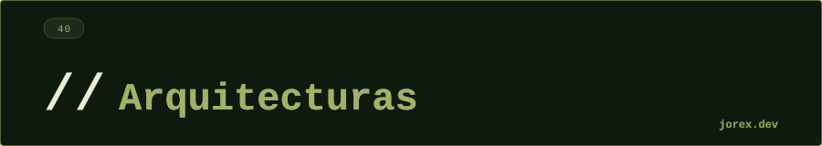

  

**¿Qué es la arquitectura hexagonal? ¿En qué se diferencia de MVC en capas?**

La arquitectura hexagonal (Ports & Adapters) coloca el dominio en el centro y define que **nada externo puede ser importado por el dominio**. El dominio expone interfaces (puertos) y el exterior implementa esas interfaces (adaptadores). La diferencia con MVC en capas es la dirección de las dependencias: en MVC el dominio suele importar repositorios concretos o anotaciones de frameworks (`@Entity`, `@Service`). En hexagonal, el dominio no sabe si está siendo llamado por HTTP, por un test, o por una cola de mensajes — solo habla con interfaces. El resultado práctico es que el dominio es completamente testeable sin arrancar Spring ni conectar a base de datos.

---

**¿Cuál es la "dependency rule" de Clean Architecture?**

La regla de dependencia establece que **el código fuente solo puede apuntar hacia adentro**. Las capas externas (frameworks, drivers, bases de datos) pueden depender de capas internas, pero nunca al revés. Los Use Cases no pueden importar nada de Spring. Las Entities no pueden importar nada de los Use Cases. Cuando una capa interna necesita algo de una capa externa (por ejemplo, persistencia), se define una interfaz en la capa interna y la capa externa la implementa — inversión de dependencia. El motor de la regla es este: los detalles (frameworks, BD) cambian frecuentemente; las reglas de negocio raramente. Si el dominio no depende de los detalles, los cambios de infraestructura no lo afectan.

---

**¿Qué es CQRS y cuándo tiene sentido aplicarlo?**

CQRS (Command Query Responsibility Segregation) separa las operaciones que **modifican estado** (commands) de las que **leen estado** (queries), con modelos y rutas de código distintos para cada una. Un command no devuelve datos de dominio (solo confirmación); una query no modifica estado. Tiene sentido cuando: el modelo óptimo para escritura (normalizado, con validaciones) difiere mucho del modelo óptimo para lectura (desnormalizado, con joins precalculados); cuando la escala de lecturas es mucho mayor que la de escrituras (se pueden replicar las proyecciones de lectura); o cuando se combina con Event Sourcing (las queries leen proyecciones construidas a partir de eventos). No tiene sentido en aplicaciones CRUD simples donde el modelo de lectura y escritura es el mismo — añade complejidad sin beneficio.

---

**¿Qué es Event Sourcing? ¿Qué ventajas y complejidades añade frente a guardar estado actual?**

Event Sourcing almacena el historial completo de eventos que llevaron al estado actual, en lugar del estado en sí. Para obtener el estado actual, se hace "replay" de todos los eventos (`apply` secuencial). Ventajas: (1) **Audit trail completo gratuito** — sabes qué pasó, cuándo y en qué orden; (2) **Temporal queries** — puedes reconstruir el estado en cualquier punto del pasado haciendo replay hasta ese momento; (3) **Debugging** — los bugs se reproducen reproduciendo la secuencia de eventos; (4) **Múltiples projections** — los mismos eventos pueden proyectarse en diferentes estructuras según las necesidades de lectura. Complejidades: (1) Los eventos son inmutables — si cambias un concepto de dominio debes versionar el evento; (2) La projection de lectura tiene consistencia eventual; (3) Si el event store crece mucho, reconstruir estado requiere snapshots periódicos; (4) La mentalidad de "guardar eventos en lugar de estado" requiere un cambio conceptual.

---

**¿Qué es un Bounded Context en DDD?**

Un Bounded Context es el límite explícito dentro del cual un modelo de dominio es consistente y tiene significado claro. El mismo término puede significar cosas distintas en contextos distintos: "Cliente" en el contexto de Ventas tiene atributos de historial de compras; "Cliente" en Soporte tiene tickets y SLAs; "Cliente" en Facturación tiene datos fiscales. En lugar de crear un único modelo que intente unificar todo (god class), DDD propone modelos separados por contexto con un **mapa de contextos** que define las relaciones entre ellos (upstream/downstream, shared kernel, anti-corruption layer). En microservicios, un Bounded Context es típicamente un microservicio (o un módulo dentro de un monolito modular).

---

**¿Qué diferencia hay entre un Aggregate y una entidad en DDD?**

Una entidad es un objeto con identidad propia que persiste a lo largo del tiempo (`Pedido` con `pedidoId`). Un Aggregate es un **grupo de entidades y value objects** que forman una unidad de consistencia, con una **Aggregate Root** que es la única puerta de entrada al grupo. Toda modificación al aggregate pasa por la raíz, que garantiza que el grupo siempre queda en estado consistente. Por ejemplo: `Pedido` es la raíz del aggregate que incluye `LineaDePedido` y `DireccionEnvio`. No se puede modificar una `LineaDePedido` directamente desde fuera — siempre a través de `Pedido.agregarLinea(...)`. El Repository trabaja con aggregates completos: `save(pedido)` guarda el aggregate entero, no líneas individuales. La regla práctica: una transacción de BD no debería cruzar límites de aggregate.

---

**¿En qué escenario combinarías Event Sourcing con CQRS?**

La combinación es natural porque Event Sourcing resuelve el problema de escritura (el event store es el modelo de escritura) y CQRS resuelve el problema de lectura (las projections son los modelos de lectura). El flujo es: un command llega al aggregate, que emite eventos; los eventos se persisten en el event store (append-only); proyectores suscritos a esos eventos actualizan las vistas de lectura desnormalizadas (en Redis, Elasticsearch, una tabla relacional). Un escenario concreto: sistema bancario donde las cuentas se modelan con Event Sourcing (audit trail obligatorio, reconstruir saldo en cualquier fecha), y las queries de "movimientos del mes", "saldo actual" o "últimas transacciones" se sirven desde projections optimizadas para cada vista, no desde replay de eventos en tiempo real.

