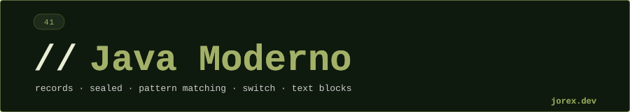

<div align="center">
  <a href="#"></a>
</div>

<div align="center"></div>

<div align="center">
  <a href="#"></a>
</div>

<div align="center"></div>

<div align="center">
  <a href="#"></a>
</div>

<div align="center"></div>

Java Moderno agrupa las features de lenguaje introducidas entre Java 14 y Java 21 que cambiaron la forma de escribir código Java idiomático. Son features de **expresividad**: eliminan boilerplate, hacen imposibles ciertos bugs y permiten modelar dominios con más precisión.

Las cinco features principales son:

- **Records** (Java 16 estable): clases de datos inmutables con componentes declarados en la cabecera. El compilador genera constructor canónico, `equals`, `hashCode` y `toString` automáticamente.
- **Sealed Classes** (Java 17 estable): jerarquías cerradas donde el compilador conoce todas las subclases. Permiten exhaustiveness checking en switch.
- **Pattern Matching** (Java 16+ para `instanceof`, Java 21 para switch): combina test de tipo + binding variable en una sola expresión. Elimina casts explícitos y code smells del tipo "check and cast".
- **Switch Expressions** (Java 14 estable): switch que produce un valor, con sintaxis de flecha `->` que elimina fall-through accidental. Soporta `yield` para casos con lógica.
- **Text Blocks** (Java 15 estable): strings multilínea con indentación inteligente. Ideales para JSON, SQL, HTML y XML embebidos en código.

> Estas features no son independientes: Records + Sealed Classes + Pattern Matching en Switch forman un sistema cohesivo para modelar datos algebraicos en Java, similar a los ADTs de lenguajes funcionales.

<div align="center"></div>

<div align="center">
  <a href="#"></a>
</div>

<div align="center"></div>

<div align="center">
  <a href="#"></a>
</div>

<div align="center"></div>

**Records**

```java
// Declaración: componentes en la cabecera
record Punto(double x, double y) {
    // Compact constructor: validación sin repetir parámetros
    Punto {
        if (x < 0 || y < 0) throw new IllegalArgumentException("Coordenadas negativas");
    }
    // Métodos custom: igual que una clase normal
    double distanciaAlOrigen() { return Math.sqrt(x * x + y * y); }
    static Punto ORIGEN = new Punto(0, 0);
}
```

El compilador genera: `Punto(double x, double y)`, `x()`, `y()`, `equals`, `hashCode`, `toString`. Los records son implícitamente `final` y sus componentes son `private final`.

---

**Sealed Classes**

```java
// La jerarquía está cerrada: solo estas implementaciones
sealed interface Forma permits Circulo, Rectangulo, Triangulo {}

record Circulo(double radio) implements Forma {}
record Rectangulo(double ancho, double alto) implements Forma {}
final class Triangulo implements Forma { /* ... */ }
```

Las subclases de una sealed class deben ser `final`, `sealed` o `non-sealed`. El compilador puede verificar exhaustiveness.

---

**Pattern Matching**

```java
// instanceof con binding variable (Java 16)
if (obj instanceof String s && s.length() > 5) {
    System.out.println(s.toUpperCase()); // s ya es String, sin cast
}

// Guarded pattern en switch (Java 21)
String resultado = switch (forma) {
    case Circulo c when c.radio() > 10 -> "circulo grande";
    case Circulo c                     -> "circulo pequenyo";
    case Rectangulo r                  -> "rectangulo " + r.ancho() + "x" + r.alto();
    case Triangulo t                   -> "triangulo";
};
```

---

**Switch Expressions**

```java
// Arrow label: sin fall-through, sin break, produce un valor
int numLetras = switch (dia) {
    case LUNES, VIERNES, DOMINGO -> 6;
    case MARTES                  -> 7;
    case JUEVES, SABADO          -> 8;
    case MIERCOLES               -> 9;
};

// yield: necesario cuando el case tiene lógica
String categoria = switch (valor) {
    case 1, 2 -> "bajo";
    default -> {
        String msg = "valor-" + valor;
        yield msg.toUpperCase();
    }
};
```

---

**Text Blocks**

```java
String json = """
        {
            "nombre": "Java",
            "version": 21,
            "features": ["records", "sealed", "patterns"]
        }
        """;
// La indentación común se elimina automáticamente
// La primera línea de contenido real empieza justo después de """
```

<div align="center"></div>

<div align="center">
  <a href="#"></a>
</div>

<div align="center"></div>

<div align="center">
  <a href="#"></a>
</div>

<div align="center"></div>

- **Menos boilerplate**: Records eliminan los getters, constructores y `equals`/`hashCode` manuales que antes requerían Lombok o generación de IDE.
- **Type safety mejorado**: Sealed classes hacen que el compilador conozca todas las variantes posibles de una jerarquía, habilitando exhaustiveness checking real.
- **Código más expresivo**: Pattern matching elimina el patrón tedioso de `instanceof` + cast + variable. El código dice lo que hace.
- **Strings legibles**: Text blocks permiten incrustar JSON, SQL o HTML sin escapes ni concatenaciones. El código fuente y la string resultante tienen la misma forma.
- **Switch seguro**: Switch expressions eliminan el fall-through accidental (bug histórico de Java) y permiten usar switch donde antes solo cabía una expresión ternaria o una variable mutable.
- **Modelado algebraico**: Records + Sealed + Pattern Matching juntos permiten tipos de datos algebraicos (ADTs) similares a los de Haskell o Rust, con verificación del compilador.

Ver los archivos `Exp*.java` para ejemplos ejecutables de cada feature.

<div align="center"></div>

<div align="center">
  <a href="#"></a>
</div>
