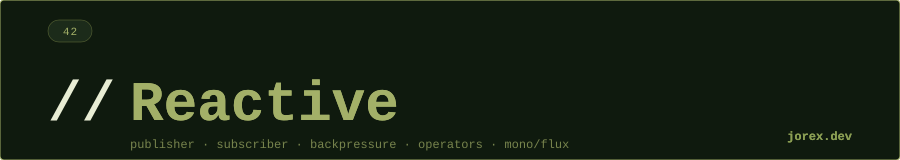

  

  

  

**¿Qué es Reactive Streams y cuáles son sus 4 interfaces?**
Reactive Streams es una especificación para procesamiento asíncrono de streams con backpressure no bloqueante. Sus 4 interfaces, disponibles en `java.util.concurrent.Flow` desde Java 9, son: `Publisher<T>` (produce elementos), `Subscriber<T>` (consume con `onSubscribe`, `onNext`, `onError`, `onComplete`), `Subscription` (contrato que permite al subscriber solicitar elementos con `request(n)` o cancelar con `cancel()`), y `Processor<T,R>` (extiende ambas, actúa como etapa intermedia de transformación).

---

**¿Cuál es la diferencia entre Mono y Flux en Project Reactor?**
`Mono<T>` representa una secuencia asíncrona de 0 o 1 elemento — se usa para operaciones que devuelven como mucho un resultado (buscar por ID, hacer una petición HTTP). `Flux<T>` representa una secuencia de 0 a N elementos, potencialmente infinita — se usa para listas, streams de eventos, paginación. Ambos implementan `Publisher<T>` de Reactive Streams. La distinción es semántica: usar `Mono` cuando se sabe que el resultado es singular comunica intención más claramente que un `Flux` que emite uno o cero.

---

**¿Qué es backpressure y cómo la gestiona Reactor?**
Backpressure es el mecanismo por el que un subscriber comunica al publisher cuántos elementos puede procesar. Sin backpressure, un publisher rápido puede desbordar un subscriber lento. En Reactive Streams, el subscriber controla el flujo llamando a `subscription.request(n)`: el publisher solo emite hasta `n` elementos. Project Reactor ofrece estrategias adicionales cuando el buffer se desborda: `BUFFER` (almacena en memoria), `DROP` (descarta los elementos que no caben), `LATEST` (solo mantiene el más reciente) y `ERROR` (propaga `OverflowException`).

---

**¿Cuándo usar flatMap vs concatMap vs switchMap?**
Los tres convierten cada elemento en un publisher interno, pero difieren en la gestión de concurrencia y orden. `flatMap` suscribe a todos los publishers internos en paralelo y emite elementos en cuanto llegan (máximo throughput, orden no garantizado). `concatMap` espera a que cada publisher interno complete antes de suscribirse al siguiente (orden garantizado, sin paralelismo). `switchMap` cancela el publisher interno anterior cuando llega un nuevo elemento — ideal para búsquedas en tiempo real donde solo interesa el último resultado. Regla práctica: `flatMap` para I/O independiente, `concatMap` cuando el orden importa, `switchMap` para eventos de usuario como typeahead.

---

**¿Qué diferencia hay entre subscribeOn y publishOn?**
`subscribeOn(Scheduler)` cambia el hilo en que se inicia la suscripción y donde corre el origen del stream — afecta toda la cadena hacia arriba. Se usa para mover I/O bloqueante a un scheduler apropiado (ej. `boundedElastic`). `publishOn(Scheduler)` cambia el hilo de procesamiento para los operadores que vienen después de él en la cadena — afecta hacia abajo. Se usa para cambiar de contexto a mitad del pipeline, por ejemplo procesar elementos en el scheduler de I/O pero notificar al subscriber en el hilo principal. Solo el `subscribeOn` más cercano al origen tiene efecto si se ponen varios; los `publishOn` sí se pueden encadenar.

---

**¿Cómo se manejan los errores en Reactor?**
Los errores viajan por el stream como señales `onError` que terminan la secuencia. Reactor ofrece varios operadores: `onErrorReturn(valor)` termina el stream emitiendo un valor de fallback, `onErrorResume(fn)` continúa con un publisher alternativo (permite lógica de fallback compleja), `retry(n)` vuelve a suscribirse hasta `n` veces ante cualquier error, `retryWhen(companion)` permite retry con backoff exponencial mediante un publisher de control, `doOnError(fn)` ejecuta un efecto secundario (logging) sin alterar el stream. La clave es que estos operadores deben colocarse en el punto correcto del pipeline — un `onErrorReturn` solo captura errores de los operadores anteriores a él.

---

**¿Cuándo elegir programación reactiva vs virtual threads?**
Java 21 virtual threads simplifican enormemente el código concurrente para I/O-bound: el estilo es imperativo síncrono pero con la escalabilidad de miles de hilos ligeros. La programación reactiva tiene sentido cuando se necesita backpressure explícito (el consumer no puede absorber el ritmo del producer), cuando se trabaja con Spring WebFlux que ya está orientado a reactive, cuando se componen pipelines complejos con ramificaciones, combinaciones y transformaciones de streams, o cuando se necesita cancelación propagada. Si el equipo ya usa Spring MVC y los patrones de concurrencia son simples, virtual threads son la opción más pragmática. Si se construye un sistema de alta carga con WebFlux o se necesita control fino del flujo, reactive es la elección natural.

  

